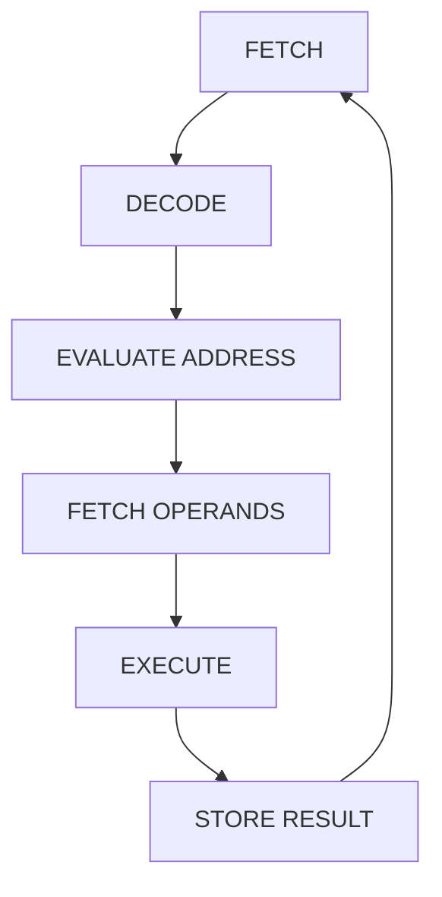
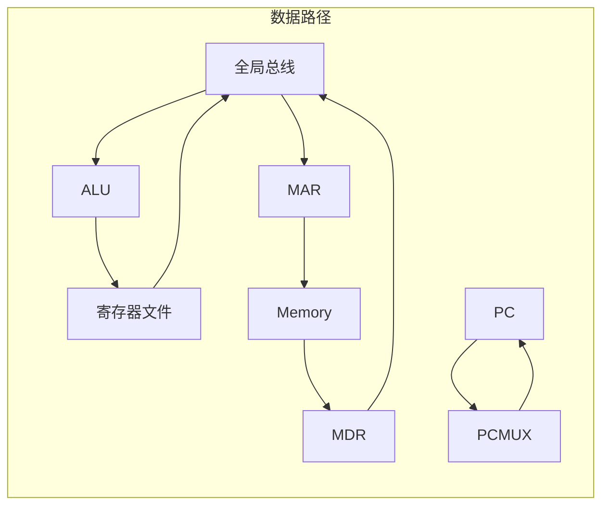

**基于冯·诺依曼模型与 LC-3 架构**  

---

## 一、冯·诺依曼模型

### 1. 历史背景

- **ENIAC**（1943）：首个通用电子计算机，硬连线编程（通过拨动开关设置程序）。
- **EDVAC**（1944）：首次引入存储程序概念，程序与数据共存储于内存。
- **冯·诺依曼报告**（1945）：提出存储程序计算机的五大组件（存储器、运算器、控制器、输入设备、输出设备），奠定现代计算机基础。

### 2. 核心组件

1. **存储器（Memory）**  
    - 存储指令和数据，按地址访问。
    - 基本操作：`LOAD`（读取）和 `STORE`（写入）。
2. **处理单元（Processing Unit）**  
    - 执行算术逻辑运算（ALU）。
    - 寄存器：临时存储操作数和结果（如 LC-3 的 8 个 16 位寄存器 R0-R7）。
3. **控制单元（Control Unit）**  
    - 协调指令执行流程，包含：  
        - **程序计数器（PC）**：指向下一条指令地址。
        - **指令寄存器（IR）**：存储当前指令。
4. 输入/输出设备：通过驱动（控制硬件设备的程序）与内存交互（如键盘、显示器）。

---

## 二、LC-3 指令集架构（ISA）

### 1. 内存与寄存器

- **内存**：  
    - 地址空间：2^16（16 位地址）。
    - 地址能力：16 位/单元。
- **寄存器**：  
    - 8 个通用寄存器（R0-R7），16 位宽。
    - 专用寄存器：PC（程序计数器）、条件码（N/Z/P，negative/zero/positive）。

### 2. 指令分类与格式

LC-3 指令为 16 位，分为三类：  

1. **运算指令**：ADD、AND、NOT。
2. **数据移动指令**：LD（加载）、LDI、LDR、ST（存储）、STI、STR、LEA（加载有效地址）。
3. **控制指令**：BR（条件分支）、JSR、JSRR、RTI、JMP（跳转）、TRAP（系统调用）。

#### 示例指令格式

- **ADD 指令**（寄存器模式）：  

```
| 15:12 | 11:9 | 8:6 | 5:3 | 2:0 |
| 0001  | DR   | SR1 | 0   | SR2 |
```  

  - 功能：`DR ← SR1 + SR2`  
  - 例：`ADD R3, R1, R2` → R3 = R1 + R2  

- **ADD 指令**（立即模式）：  

```
| 15:12 | 11:9 | 8:6 | 5     | 4:0      |
| 0001  | DR   | SR1 | 1     | imm5     |
```  

  - 功能：`DR ← SR1 + imm5（符号扩展）`  
      - 例：`ADD R3, R1, #5` → R3 = R1 + 5  

---

## 三、指令处理流程

### 1. 六大阶段



#### 详细说明

1. **FETCH**：  
    - 将 PC 内容送入 MAR，读取指令到 IR，PC 递增（PC ← PC + 1）。

```c  
MAR ← PC;  
MDR ← Memory[MAR];  
IR ← MDR;  
PC ← PC + 1;  
```  

1. **DECODE**：  
    - 解析操作码（IR[15:12]），确定指令类型和操作数。
    - 例：`LDR` 指令的后 6 位为偏移量。

2. **EVALUATE ADDRESS**：  
    - 计算内存地址（如基址 + 偏移量）。

```c  
Address = BaseReg + SignExtend(offset);  
```  

1. **FETCH OPERANDS**：  
    - 读取操作数（寄存器或内存）。

2. **EXECUTE**：  
    - 执行运算（如 ALU 加法）。
    - 或者不做任何事（如 load、store）。

3. **STORE RESULT**：  
    - 将结果写入目标寄存器或内存。

---

## 四、寻址模式

### 1. PC 相对寻址（LD/ST）

- 用 9 位有符号偏移量（IR[8:0]）与 PC 相加得到地址，范围是 [PC - 256, PC + 255]。
- 例：`LD R2, Label` → `R2 ← Memory[PC + offset]`  


### 2. 基址 + 偏移寻址（LDR/STR）

- 基址寄存器（如 R3）加 6 位偏移量（符号扩展）。
- 例：`LDR R2, R3, #6` → `R2 ← Memory[R3 + 6]`  


### 3. 间接寻址（LDI/STI）

- 先通过 PC 相对寻址获取地址，再访问该地址指向的内存。
- 例：`LDI R2, Label` → `R2 ← Memory[Memory[PC + offset]]`  


### 4. 直接寻址（LEA）

- 将地址直接保存在寄存器中


---

## 五、控制指令与条件码

### 1. 条件分支（BR）

- 根据条件码（N/Z/P）决定是否跳转。
- 例：`BRnz Label` → 若结果为负或零，跳转到 `PC + offset`。


### 2. 跳转（JMP）

- 无条件跳转到寄存器中的地址。
- 例：`JMP R3` → `PC ← R3`  

### 3. TRAP

- 将 PC 设置为 "the address of an OS service routine"，并在下一条指令交回控制权

---

## 六、数据路径与组件



- **全局总线**：传输 16 位数据，由控制信号选择驱动源（如 ALU、寄存器）。
- **ALU**：执行算术逻辑运算，输入来自寄存器和立即数。
- **PC 与 MAR**：通过多路选择器（PCMUX/MARMUX）选择地址来源。

---

## 七、编程示例

### 计算 12 个整数之和（地址 X3100 开始）

```assembly  
        AND R3, R3, #0    ; R3 = 0（累加器）  
        LD R1, #-100      ; R1 = x3100（数据起始地址）  
        AND R2, R2, #0    
        ADD R2, R2, #12   ; R2 = 12（计数器）  
Loop:   BRz Done          ; 若R2=0，跳转到Done  
        LDR R4, R1, #0    ; R4 = Memory[R1]  
        ADD R3, R3, R4    ; R3 += R4  
        ADD R1, R1, #1    ; R1++  
        ADD R2, R2, #-1   ; R2--  
        BR Loop  
Done:   HALT  
```  

---

## 八、关键概念总结

1. **ISA 的核心作用**：定义程序员可见的硬件特性（指令集、寄存器、内存模型）。
2. **冯·诺依曼瓶颈**：指令与数据共享总线，导致潜在的性能限制。
3. **LC-3 的简洁性**：仅 15 条指令，但可通过组合实现复杂操作（如用 ADD 和 NOT 实现减法）。

---  
**注**：更多细节可参考 LC-3 手册
